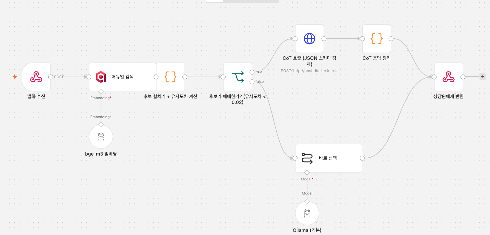

어제 18건 중 14건(77.8%)을 맞혔다. 오늘은 88.9%까지 상승.


## 어디를 고쳐야 하는지부터

```
검색: 정답이 상위 3개 안에 있는 비율   18/18 (100%)
선택: 그중 맞게 고른 비율             14/18 (77.8%)
```

정답은 언제나 후보 안에 있었다. 틀린 4건도 그랬다.

| 발화 | 정답이 몇 위였나 | 모델이 고른 것 |
|---|---|---|
| #2 배송조회가 계속 배송중 | **1위** | 2위 |
| #3 인천 화재 뉴스 | 2위 | 3위 |
| #4 카드 환불 언제 | 3위 | 1위 |
| #15 신선식품 상할까봐 | 3위 | 1위 |

검색은 이미 다 찾아왔다. **손실은 전부 고르는 단계에서 났다.** 

## 안 된 것

### 리랭커

한국어 크로스인코더(`bge-reranker-v2-m3-ko`)를 붙였는데, 순위가 **한 건도 안 바뀌었다.** 점수를 열어보니 후보 전부가 -14.4 근처였다. 모델이 "여기 맞는 게 하나도 없다"고 답한 것이다.

원인을 갈라보니 질의 문체였다.

```
구어체 질의 × 매뉴얼 원문   →  -14.46
정제 질의   × 매뉴얼 원문   →  +10.64
```

매뉴얼을 답변체로 고쳐 써도 점수는 그대로였고(-14.34), 질의만 바꾸니 25점이 뛰었다. 크로스인코더가 구어체에 극단적으로 약하다. bge-m3는 같은 발화에서 정답을 공동 1위에 뒀는데 리랭커는 무관하다고 판정한다.

찾아보니 비격식·구어체 질의가 RAG를 무너뜨리고 그 피해가 생성보다 **검색 쪽에 몰린다**는 논문이 있었다. 내가 만든 발화 데이터가 그런 경우인데, 받아쓰기를 나타내려고 일부러 구어체로 만들었다.


### 질의 정규화

그 논문이 제안한 방안은, 발화를 정제된 질문으로 바꾼 뒤 검색한다.

| | 정확도 | 발화당 추가 비용 |
|---|---|---|
| 발화 원문 | 14/18 | 0 |
| LLM으로 정제 후 | 14/18 | **+1,542ms** |

총점이 그대로다. 어려운 3건(#3·#4·#15)을 고치는 대신 쉬운 2건을 깨뜨렸다. 정보가 빠져서다.

```
"화장품 바르고 얼굴에 붉게 올라와서 환불 되나요"
  → "환불이 가능하나요?"    상품 하자 단서가 사라짐
```

어제 에이전트가 검색어를 망친 것과 원인이 같다. 3B에게 문장을 다시 쓰게 하면 정보가 빠진다.

**결과: 1.5초를 더 쓰고 얻는 게 없어 안 씀. 발화는 가공 없이 그대로 검색어로.**

### 항상 따져보게 하기

후보 3개를 놓고 "각각 왜 맞는지 따진 다음 고르라"고 시켰다.

| | 정확도 | 평균 지연 |
|---|---|---|
| 그냥 고르기 | 14/18 (77.8%) | 6.7초 |
| 따져보고 고르기 | 13/18 (72.2%) | 34.1초 |

여기서 갈린 게 뚜렷하다.

```
고친 것   : #3, #4, #15      정답이 2·3위에 묻혀 있던 어려운 것
깨뜨린 것 : #1, #9, #14, #17  정답이 이미 1위였던 쉬운 것
```

따져보라고 시키면 모델이 1위를 그대로 받아들이지 않는다. 어려운 문제에선 1위가 실제로 틀렸으니 좋아지고, 쉬운 문제에선 맞는 답을 굳이 바꿔서 나빠진다. 3B는 이 둘을 구분하지 못한다.

> 참고로 첫 시도는 8/18이었는데, Ollama에 JSON 스키마를 줘서 출력 구조를 강제하니 72.2%가 나왔다. 필드 순서를 `검토 → 선택`으로 두면 따져본 다음 고른다는 성질이 유지된다.

## 된 것 — 애매할 때만 따지기

모델이 구분 못 하니 사람이 기준을 준다. 1위와 2위의 유사도 차이를 보자.

```
따져서 고친 것   : 0.0011, 0.0130, 0.0148        모두 0.015 이하
따져서 깨뜨린 것 : 0.0081, 0.0240, 0.0780, 0.1085
                              ↑ 0.0148과 0.0240 사이가 비어 있다
```

**임계치 0.02.** 그 빈 구간의 중간이다. 겹치는 한 건(0.0081)은 추론이 아니라 파싱이 실패한 경우라, 파싱이 깨지면 기본 방식으로 되돌리는 장치를 뒀다.

| 방식 | 정확도 | 평균 지연 |
|---|---|---|
| 항상 그냥 고르기 | 14/18 (77.8%) | 6.7초 |
| 항상 따져보기 | 13/18 (72.2%) | 34.1초 |
| **애매할 때만 따지기** | **17/18 (94.4%)** | **9.8초** |

모델이 정답을 따지는 경우는 18건 중 4건(22%). 
지연이 크게 늘지 않았고, 이 임계치는 18건으로 정한 값이라 발화가 늘면 다시 튜닝하는 과정을 거쳐야겠지만..


## 늘어난 워크플로우

| 주소 | 구조 | 정확도 | 평균 지연 |
|---|---|---|---|
| `/webhook/assist` | 에이전트 + 도구 (어제, 폐기) | 55.6% | 23.7초 |
| `/webhook/assist-rag` | 검색 고정 + 바로 선택 (어제) | 77.8% | 4.7초 |
| `/webhook/assist-cot` | 검색 고정 + 조건부 따져보기 | **88.9%** | 12.6초 |

화면에서 클릭해 바꾸도록 배치한 것들이다.

| 바꿀 것 | 어디 |
|---|---|
| 따지기를 켜는 기준 (0.02) | 조건 분기 노드 |
| 후보 개수 | 검색 노드 |
| 두 가지 프롬프트 | 각 노드 본문 |
| JSON 스키마 | HTTP 호출 노드 본문 |

기준을 코드가 아니라 분기 노드에 둔 게 핵심이다. 숫자를 바꾸려고 자바스크립트를 열 필요가 없다.

## 남은 2건은 모델 문제가 아닐 수 있다

정확도가 안 오르는 원인을 모델에서만 찾다가, 매뉴얼끼리 얼마나 겹치는지 재봤다.

```
M004 ↔ M005   0.7892   (105쌍 중 1위)
M004 ↔ M008   0.7833
                        전체 평균 0.5817
```

```
M004: "카드사 승인 취소로 처리되며 평일 기준 3~7일 이내 반영"
M008: "카드사 승인 취소 반영에 평일 3~7일이 걸림을 안내"
```

**같은 사실이 두 매뉴얼에 들어 있다.** "환불 신청했는데 카드로 결제했다"는 둘 다 해당하고, 어느 쪽을 골라도 상담원에게 나가는 정보는 같다. 모델 오답이라고 부르기 어렵다.

#15도 정답 표시 자체가 의심스럽다. "신선식품이 상할까 걱정"에 물류센터 광역 지연 매뉴얼을 정답으로 달아놨는데, 발화에 화재나 장애 얘기가 없다.

그래서 88.9%는 낮게 잡힌 값일 수 있다. 다만 지금 데이터를 고치면 이전 측정치와 비교가 끊기니, 고치지 않고 의심 지점으로만 표시해뒀다.

**모델보다 문서-데이터를 의심해봐야..** 

## 정리

```
어제  검색만            상위 3개 안에 100% /  55ms
어제  에이전트 + 도구     55.6% / 23.7초   ← 걷어냄
어제  검색 고정          77.8% /  4.7초
오늘  애매할 때만 따지기   88.9% / 12.6초
```

## To Do

**1. 발화·매뉴얼 데이터 늘리기**

지금 수치는 전부 발화 18건, 매뉴얼 15조각에서 나왔다. 규모를 늘려 테스트해보아야함.

- 임계치 0.02는 18건의 분포를 보고 잡았다. 발화가 늘면 다시 튜닝해야함
- 매뉴얼이 늘수록 서로 겹칠 가능성도 커진다. M004와 M008이 이미 0.78이다.

**2. STT 앞단 연결**

지금은 받아쓴 텍스트를 웹훅에 직접 넣고 있다. 
웹훅이 `{"utt": "..."}`를 받는 구조라, STT가 그 주소로 쏘게만 하면 연결된다. 발화에 아무 가공도 안 하므로 중간 단계가 없다.

**3. 상담원 화면 임시로 만들어보기**

지금은 `curl`로만 확인했다. 실제로 상담원이 볼 화면이 있어야 쓸 만한지 판단할 수 있다.

검색이 55ms, 안내 문장이 12.6초 이 차이를 화면에서 나눠 쓸 수 있다. 
매뉴얼 후보 3개를 먼저 띄우고(상위 3개 적중률 100%라 정답이 반드시 그 안에 있다) 안내 문장은 뒤따라 붙이는 식이다. 상담원은 기다리지 않아도 된다.
